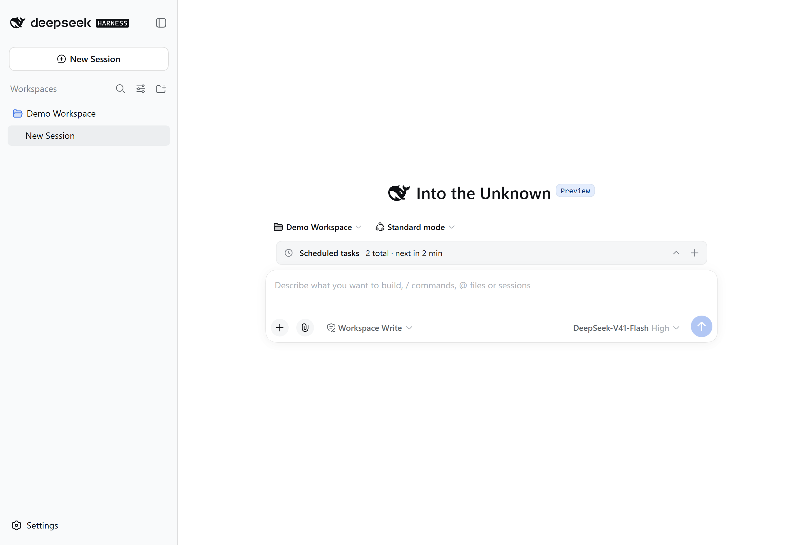
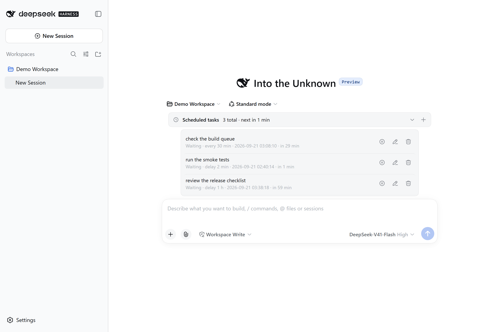
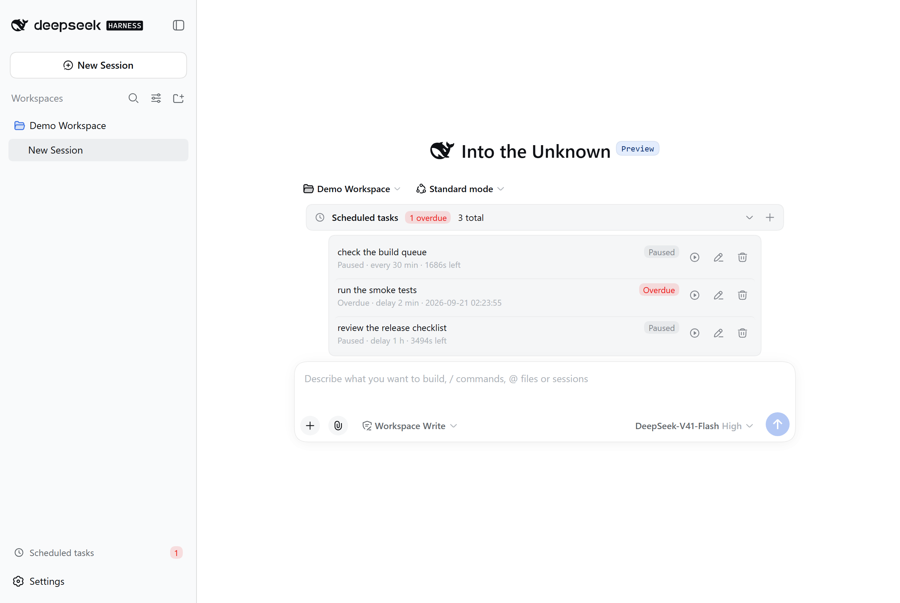

<div align="center">

# dsh-tick

**Schedule work inside a DSH session: when the time comes, a prompt is injected into the current session to wake the model up and run it.**

**English** · [中文](README.md)

[](#install)
[](LICENSE)
[](https://github.com/deepseek-ai/deepseek-harness)
[](https://www.npmjs.com/package/dsh-tick)



<sub>The collapsed summary row above the composer — click it to manage tasks.</sub>

</div>

---

## What it does

You want the AI to "check the build queue in 5 minutes", "summarize today's work
at 11pm", or "look at the deployment every 10 minutes" — **say it once, and it
happens on time**.

dsh-tick brings scheduling into **the current session**: at the appointed time
your prompt is injected into that session, waking the model to carry it out.
Tasks belong to the session that created them and **never leak into another one**.



---

## Three timing modes

| Mode | How you ask | Behaviour |
|---|---|---|
| **Delay** | "check the build queue in 2 minutes" | Runs once when the countdown ends |
| **Fixed time** | "summarize my work at 23:00 today" | Runs once at that moment |
| **Periodic** | "look at the deployment every 30 minutes" | Fires on a fixed interval until you pause or delete it |

> **Delays are capped at 30 days** (longer ones are rejected, and the error tells
> you to use fixed-time mode instead); **periodic intervals have no duration cap**.
> To wait longer, use **Fixed time** with an absolute moment.
>
> One caveat for very long intervals: timers freeze while DSH is closed, so a
> periodic task only keeps a true interval while DSH stays open.

---

## Three ways to manage tasks

One set of tasks, whichever way you prefer:

1. **The panel above the composer** — expand it to see time remaining, pause, edit, delete;
2. **The `/schedule` command** — create one right in the chat box, no panel needed;
3. **Let the assistant manage them** — your model can create, list, pause and delete tasks directly.

```
/schedule +30m check the build queue
/schedule +2h30m summarize today's changes
/schedule every 10m look at the deployment
/schedule @2026-09-21T09:00:00+08:00 summarize what is left before standup
/schedule list
```

> Durations use `s` / `m` / `h` (e.g. `+30m`, `+2h30m`); Chinese units
> (秒 / 分钟 / 小时) work too. The `d` (days) unit is **not** supported — to wait
> more than a day, use **Fixed time** with an absolute moment instead.

---

## How it behaves

**Pause and resume freeze the remaining time.** Pause a task with 4 minutes left,
resume it tomorrow, and it still waits 4 minutes — it will not fire immediately
just because a night passed.

**Timers freeze while DSH is closed** (delay and periodic modes). When you reopen
DSH those tasks come back **paused**, so nothing fires while you are away.
A fixed-time task whose moment passed in the meantime is marked **Overdue** and
waits for you.



The three rows above are: **Paused** (periodic), **Overdue** (fixed time, missed
across a restart), and **Paused** (delay). The red number in the sidebar footer is
the total overdue count across all sessions.

**An overdue task runs the moment you press play** — the resume action *is* "run now".

---

## Install

```bash
dsh plugin --profile web add dsh-tick
```

Restart DSH afterwards.

> Requires DSH `0.1.5-rc.2` or newer — **both 0.1.5 and 0.2.0 are tested**, see
> "Compatible DSH versions" below. The plugin **does not touch** `settings.yaml`;
> uninstalling removes it along with its own folder, leaving nothing behind.

---

## Configuration

The plugin keeps its own config file inside its own folder
(**nothing is written to DSH's `settings`**):

```jsonc
{
  // Language of the prompt injected into the model: 'en' (default) | 'zh' | 'custom'
  "serverPromptLanguage": "en",

  // ── These three gates ship with CONSERVATIVE defaults — raise them to taste ──
  "maxTasksPerSession": 50,      // how many tasks one session may store
  "maxActivePerSession": 10,     // how many may be enabled at once
  "maxInjectionsPerMinute": 1,   // injections per minute (guards self-loops)

  "heartbeatMs": 15000,          // heartbeat interval: timer precision across restarts
  "graceMs": 60000,              // tolerance so a task that just fired is not called "missed"
  "showDock": true,              // show the panel above the composer
  "showSidebarSummary": false,   // sidebar footer summary entry (off by default)
  "allowAiCreate": true          // let the model create tasks
}
```

> ⚠️ **The three gates default to conservative values** (`maxTasksPerSession: 50`,
> `maxActivePerSession: 10`, `maxInjectionsPerMinute: 1`). They exist to **catch
> runaway batches of AI-created tasks and self-injection loops** — they are not
> performance limits. If they feel tight in daily use, **just raise them**:
> they are a safety rope for you, not a hard product constraint.
>
> Every option here **takes effect immediately** — no DSH restart needed.

### Injection language (`serverPromptLanguage`)

Controls the language of **the prompt the model sees**, independently of the UI language:

| Value | Effect |
|---|---|
| `"en"` (**default**) | English |
| `"zh"` | Chinese |
| `"custom"` | Your own templates |

Defaulting to English matches what DSH's own goal / todo / schedule plugins do:
they ship a bilingual UI, but **the prompt injected into the model is always English**.

Choosing `custom` generates a template file with full inline documentation,
**picked up on the next injection — no restart needed**. If that file is ever
corrupted, the plugin renames it to `.bad-<timestamp>`, regenerates the initial
template, and shows a one-off notice in the conversation.

---

## UI language

The panel, the sidebar entry and `/schedule` replies follow **DSH's language
setting** (Settings → General → Language) — both Chinese and English are supported.
Chinese is used when no choice has been made.

> The prompt injected into the model uses `serverPromptLanguage` above and is
> **independent of the UI language**.

---

## Boundaries with DSH

- **No custom events in the session log.** Task state lives in the plugin's own
  folder. DSH's session log enforces an event-type allowlist and offers no public
  way for a plugin to register its own types.
- **Injected messages are marked as plugin-sourced** and never impersonate the
  user. Session history always distinguishes "what you said" from "what the timer injected".
- **It does not take over the official `dsh-schedule`.** That plugin is a
  *host-wide durable reminder* system (cross-session, and it can wake cold sessions);
  this one is a *session-local task* system. They occupy different niches — running
  both leaves you and the model facing two scheduling systems.

---

## Compatible DSH versions

One and the same codebase supports **both DSH 0.1.5 and 0.2.0**, because those two
versions ship completely different `dsh-settings` APIs:

| | 0.1.5 | 0.2.0 |
|---|---|---|
| Reading config | `settings.get('locale')` | `settings.describe()` (**`get` removed**) |
| Config change notification | `settings.watch(cb)` | the `settings/document-updated` event (**`watch` removed**) |

The plugin picks the right path via **capability detection**
(`typeof settings.get === 'function'`) rather than a version check, so there is
nothing to configure and no per-version package to install. If the official API
changes again, the worst case is that a language change takes effect on the next
tool call — **it will not error out or stop working**.

> Apart from those two, everything this plugin uses — `defineTool`,
> `ctx.tools.register`, `createUserMessage`, `connection.fetch.register`,
> `ctx.slots.register`, `ctx.locale.*` — is **unchanged** in 0.2.0.

---

## Appendix: why there is no in-session icon

**You will not see a scheduled-task icon in the session list. That is not an
oversight — the official mechanism simply cannot provide one.**

DSH's sidebar exposes only six slots, and the session-list area
(`sidebar.workspaces`) is a **`single`** slot already claimed by the official
workspace UI. `single` means "the highest-priority renderer wins": a second
registrant **replaces** rather than joins, so nothing can be added incrementally.
Inside an individual session row there is no slot render point at all.

The only workable path is DOM injection keyed on minified class names — it breaks
on every DSH release and fails silently when it does. Not worth it. The official
goal and todo plugins have no in-session icon either.

**The alternative: a cross-session summary entry in the sidebar footer**
(`showSidebarSummary`, off by default). Turn it on and it shows the pending and
overdue totals across all sessions; clicking it expands a cross-session list you
can jump from. It uses the official `sidebar.footer.action` slot with zero DOM
dependency — just set `showSidebarSummary` to `true` in the config above.

---

## Known limitations

- **Timers need DSH running.** Delay and periodic modes **freeze** while DSH is
  closed; keep DSH open if you need them to follow real time.
- **No catch-up.** Rounds missed while DSH was closed are **discarded**, not
  replayed on restart.
- **Injection rate defaults to 1 per minute** (`maxInjectionsPerMinute`): if you
  set a shorter interval than that, the extra firings are throttled. Raise this
  value if you need faster.
- **The `d` (days) unit is not supported.** Use `h` (e.g. `+48h`) or **Fixed time**.

---

## License

MIT

Copyright (c) 2026 Saretheya · MIT License
